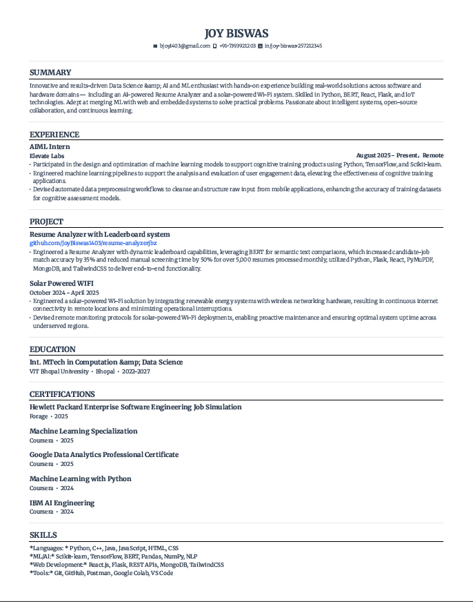

<!-- Banner -->

  

# 📄 Joy Biswas – Resume

  

  
  

---

## 🔗 Quick Links
- 📄 *[View Resume (PDF)](JOY%20BISWAS's%20Resume%20(2).pdf)*
- 📥 *[Download Resume](JOY%20BISWAS's%20Resume%20(2).pdf?raw=true)*
- 🌐 **[LinkedIn](https://www.linkedin.com/in/joy-biswas-257212345/)**
- 💻 **[GitHub Projects](https://github.com/JoyBiswas1403)**
- 🚀 **[Featured Project – Resume Analyzer](https://github.com/JoyBiswas1403/resume-analyzerjbz)**

---

## 🖼 Resume Preview
.pdf)

---

## 🧑‍💻 Summary
Innovative and results-driven *Data Science & AI/ML enthusiast* with hands-on experience building *real-world software and hardware solutions* — from AI-powered resume analyzers to solar-powered connectivity systems. Skilled in *Python, BERT, React, Flask, and IoT* technologies. Passionate about *intelligent systems, open-source collaboration, and continuous learning*.

---

## 💼 Experience
🏢 *Elevate Labs* – AIML Intern (Aug 2025 – Present, Remote)  
- Designed & optimized ML models for cognitive training products using *Python, **TensorFlow, and **Scikit-learn*.  
- Built ML pipelines for analyzing user engagement data, improving application effectiveness.  
- Automated data preprocessing workflows, enhancing dataset quality.

---

## 🚀 Projects
### 📌 [Resume Analyzer with Leaderboard System](https://github.com/JoyBiswas1403/resume-analyzerjbz)
- Leveraged *BERT* for semantic text comparisons, improving candidate-job match accuracy by *35%*.  
- Reduced manual screening time by *50%* for over *5,000 resumes monthly*.  
- *Tech:* Python, Flask, React, PyMuPDF, MongoDB, TailwindCSS.

### 📌 Solar Powered Wi-Fi (Oct 2024 – Apr 2025)
- Integrated renewable energy systems with wireless networking hardware for continuous connectivity in remote areas.  
- Developed remote monitoring protocols to ensure uptime and proactive maintenance.

---

## 🎓 Education
*Int. MTech in Computation & Data Science*  
VIT Bhopal University (2022 – 2027)  

---

## 📜 Certifications
- Hewlett Packard Enterprise Software Engineering Job Simulation (Forage, 2025)  
- Machine Learning Specialization (Coursera, 2025)  
- Google Data Analytics Professional Certificate (Coursera, 2025)  
- Machine Learning with Python (Coursera, 2024)  
- IBM AI Engineering (Coursera, 2024)  

---

## 🛠 Skills
| Category | Skills |
|----------|--------|
| *Languages* | Python, C++, Java, JavaScript, HTML, CSS |
| *ML/AI* | TensorFlow, Scikit-learn, BERT, Pandas, NumPy, NLP |
| *Web* | React.js, Flask, REST APIs, MongoDB, TailwindCSS |
| *Tools* | Git, VS Code, Google Colab, Postman |
| *Embedded* | Arduino, ESP8266, TP4056, Solar Circuit Design |

---

## 📬 Contact

  
  
  

---

  

